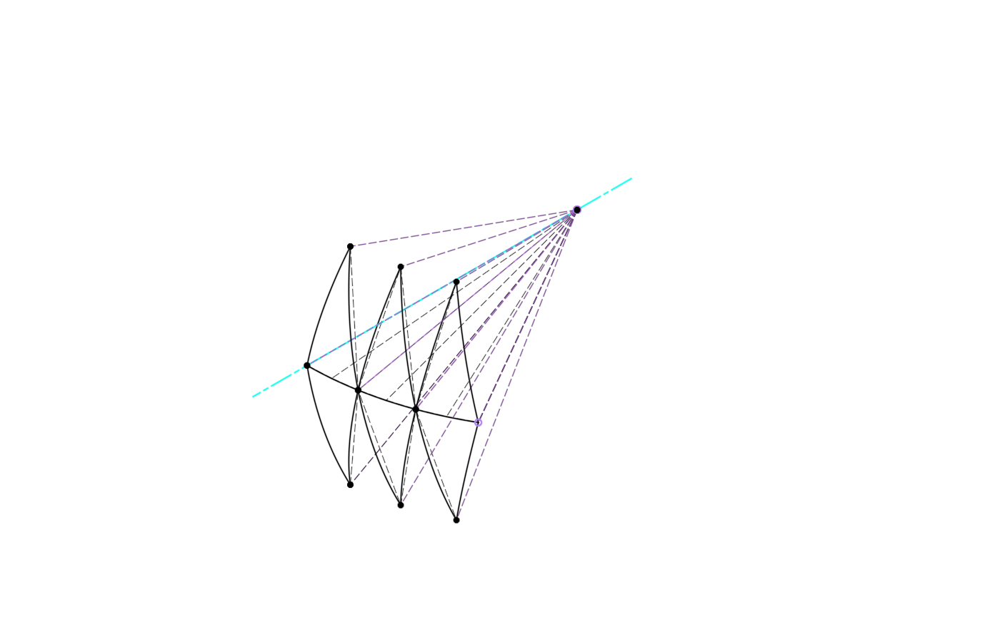

# Spherical Scissor Link Generator

A Fusion 360 script that generates the fully-parametric sketch skeleton of an
*n*-rhombi spherical scissor linkage (SSM), after Castro et al., *"A compact
3-DOF shoulder mechanism constructed with scissors linkages for exoskeleton
applications"*, Mechanism and Machine Theory, 2019.

You pick a **sphere centre**, a **spine plane**, and the **design parameters**;
every joint, link plane, and link arc is solved and constrained from there.



## Install

> Editing the source in VS Code? Run `pwsh -File tools/Refresh-FusionPaths.ps1`
> first so `import adsk.core` resolves — see [Development](#development).

There are two entry points and they share the same dialog and geometry code.
**Prefer the add-in**; the script exists for development and as a fallback.

### Add-in (recommended)

1. **Utilities → ADD-INS → Scripts and Add-Ins** (or `Shift+S`).
2. On the **Add-Ins** tab, click the green **+** next to *My Add-Ins*.
3. Select the `SphericalScissorAddIn` folder in this repo.
4. Select it in the list and hit **Run**. Tick **Run on Startup** to keep it
   loaded.

A **Spherical Scissor** panel appears in the **UTILITIES** tab with a Generate
button. Only the add-in can register the CustomFeature definition, because
Fusion requires that to happen at add-in startup.

The add-in deliberately imports the `ssm` package from the
`SphericalScissorGenerator` folder rather than keeping its own copy, so keep
both folders side by side in the repo.

### Script

1. Same dialog, `Shift+S`, **Scripts** tab, **+** next to *My Scripts*.
2. Select the `SphericalScissorGenerator` folder, then **Run**.

No toolbar button, and no custom feature — the timeline group packing is used
instead.

Either way the document must be **parametric** (Capture Design History on);
both entry points check and tell you if it is not.

## Using it

A dialog opens before anything is created, with a **live preview** — as soon as
the inputs describe a solvable mechanism the skeleton appears in the viewport,
and it updates as you change values. OK is greyed out while anything is invalid,
and the status line at the bottom says either what is wrong or what is about to
be built.

| Input | Meaning |
| --- | --- |
| **Sphere centre** | A point at the centre of rotation (RCM). The origin point, a construction point, a sketch point, or a vertex. |
| **Spine plane** | The plane the rhombi chain runs in. Must contain the centre. |
| **Start plane** | Where the chain begins. Joint A lands on this plane, and the spine leaves it at a right angle. |
| **Direction** | Counter-clockwise or clockwise, seen looking along the spine plane normal — which way the chain fans out from the start plane. |
| `link_Radius` | Diameter of the tracked sphere (the sphere radius is `link_Radius / 2`). |
| `beta` | Conflict / bearing intrusion angle. |
| `span_max` | Maximum designed spanned angle — sizes the links, draws nothing. |
| `n` | Number of rhombi. |
| `span_target` | Spanned angle of *this* configuration — this is what gets drawn. |
| `l_offset`, `bar_thickness`, `bar_width`, `bearing_OD` | Carried into the parameter table for the later solid stage. |

The two planes do the orienting. They meet in a line; that line is joint A's
direction, and it becomes `SSM_Axis_OA` — the same axis the seed link planes are
rotated about by ±`lambda`. The spine sketch holds its first spoke collinear
with it, so the start plane stays a **live driver**: move it and the whole chain
re-orients.

Because the spine is a curve inside the spine plane, it can only leave the start
plane at a right angle if the two planes are themselves perpendicular. That is
checked, along with both planes passing through the centre; you get a specific
message rather than silently wrong geometry.

Options: **Start from the opposite side** puts A at the other end of the plane
intersection. **Delete features from previous runs** removes everything named
`SSM_*` so re-running iterates in place rather than piling up duplicates; it
never touches geometry the script did not create. **Live preview** can be turned
off if rebuilding on every change feels slow (a 3-rhombi build takes about 1.4 s).

If the origin point is not selectable, switch on the **Origin** folder in the
browser.

## Layout

The entry script is the Fusion command dialog and nothing else; the geometry
lives in the `ssm` package beside it.

```
SphericalScissorGenerator/
├── SphericalScissorGenerator.py    command dialog, handlers, run()
├── SphericalScissorGenerator.manifest
└── ssm/
    ├── vectors.py      3D helpers; touches no document
    ├── parameters.py   the parameter table, expression solving, validation
    ├── frame.py        resolves eA / eF / eN from the two plane selections
    ├── sketching.py    nudged arcs, spokes, chords, dimensions
    ├── builder.py      the link chain
    └── audit.py        independent re-measurement of what was built
```

`parameters.solve_expressions` evaluates a design **without touching the
document**, which is what lets the dialog validate input and drive the preview
before anything is created. `builder.build` solves and checks everything up
front, so a rejected input leaves the document untouched rather than half-built.

Fusion keeps modules loaded between runs, so an edited submodule would keep
running its old code until Fusion restarts. Both scripts drop stale `ssm`
modules from `sys.modules` before importing, so edits take effect on the next
run.

## What it builds

By default the whole run is **packed**: every feature goes into a sub-component
named *Spherical Scissor*, and the timeline range (including the component
creation) is collapsed into a single named group. The browser shows one
component and the timeline shows one entry; expand either to see the details.
Re-running with *Delete features from previous runs* replaces the component in
place. Untick *Pack into one component + timeline group* to build loose into
the root component instead.

**Part Design documents** (the default for new documents since Fusion's
January 2026 Intent-Driven Design update) allow exactly one component, so the
sub-component cannot be created there. The generator detects this and falls
back automatically: the mechanism builds into the root component and the
timeline group is still applied, with a note in the report. For the packed
sub-component, use a **Hybrid Design** or Assembly document (Document Settings
→ edit the design type).

The mechanism stays fully live either way — the parameters below are ordinary
user parameters, so editing them in **Modify → Change Parameters** re-solves
everything inside the package. (This is the pragmatic stand-in for a true
"custom feature" with edit-in-dialog; see the note at the end.)

```
SSM_Axis_OA          spine plane x start plane: joint A's direction
SSM_Spine            spine arc (span_target) + 2n+1 radial fan
SSM_Plane_Seed_P/N   spine plane rotated by +/- lambda about OA
SSM_Link_Seed_P/N    the two mirror-image alpha links A -> P1
SSM_Plane_Long{i}_*  3-point planes (centre, pin, spine node)
SSM_Link_Long{i}_*   2*alpha middle links, pin -> node -> next pin
SSM_Plane_End_*      3-point planes at the apex
SSM_Link_End_*       terminal alpha links -> apex
```

`2n + 2` links total: 2 seed, `2(n-1)` middle, 2 terminal.

Derived parameters are written into the document's parameter table, so the
result stays live after generation — change `span_target`, `link_Radius`,
`beta`, or `span_max` and the whole skeleton re-solves:

```
sphere_Radius = link_Radius / 2
alpha         = acos(cos(beta) * cos(span_max / (2 * n)))
delta         = span_target / n
gamma_        = acos(cos(alpha) / cos(delta / 2))          # pin elevation
lambda        = acos((cos(alpha) - cos(delta)*cos(alpha))
                     / (sin(delta) * sin(alpha)))          # seed dihedral
```

`n` is topology, not a dimension: changing it means re-running the script, not
editing the parameter. Everything else is live.

## Design rules the generator enforces

These came out of building the reference model by hand, and they are what keep
the result regeneration-stable:

- **One sketch = one link = one single arc**, spanning exactly `alpha` or
  `2*alpha`. A link's role depends on `n`, so links are never grown or extended
  into a new role — the whole chain is generated in one pass.
- **Uniform degree-of-freedom scheme.** Every link arc is welded at its centre
  and near end, then closed by *exactly one* further constraint: an equal-chord
  for middle links (whose far pin is being discovered) or an `alpha` angular
  dimension for seed and terminal links. Welding centre and both ends is
  redundant-by-one and makes the solver pick branches unpredictably.
- **Planes never reference arc geometry.** Every construction plane is built
  from the centre point, spine fan points, or construction-spoke endpoints, so a
  link arc can be rebuilt without breaking anything downstream.
- **Every joint carries a construction spoke** from the centre; downstream
  features bind to spoke endpoints.
- **Sketch entities are created nudged off their final pose**, then constrained.
  Creating geometry exactly on an existing point lets Fusion auto-snap it, and
  the hidden coincidence makes the later explicit constraint fail with
  `VCS_SKETCH_OVER_CONSTRAINTS`.

## Self-verification

The terminal links are dimensioned to `alpha` and are **not** welded to the
apex — so where they land is an independent check on the formulation. After
each run the script reports:

- every link's measured arc length as a multiple of `alpha` (via the curve
  evaluator, not endpoint positions — a corrupted solver state can put endpoints
  in the right place while the curve itself is wrong);
- whether every sketch is fully constrained;
- the closure residual at the apex;
- any unhealthy timeline feature.

Typical run (`n = 3`, defaults): closure residual `2.3e-14 mm`, all eight links
exactly 1 or 2 `alpha`.

Impossible parameter sets are rejected before anything is drawn, with the reason
— e.g. `delta/2 >= alpha` means the rhombus cannot close, so either lower
`span_target`, raise `n`, or raise `span_max`.

One hazard the dialog cannot guard: **Modify → Change Parameters** accepts any
value, including impossible ones. Driving the parameters through an invalid
region (e.g. `span_target` large enough that `delta/2 >= alpha`) can flip an
equal-chord constraint onto its mirror solution, and reverting the parameter
does **not** flip it back — a middle link then measures ~2.3&nbsp;alpha instead
of 2. The sketches still report fully constrained (they are — onto the wrong
branch), so the arc-length audit is what catches it. The fix is simply to
re-run the generator: a fresh build always lands on the correct branch.

## Verified against

- `n = 1, 2, 3, 4, 6` — link counts `2n+2`, closure residual `~1e-14 mm`.
- Joint-by-joint against the hand-built reference model at `n = 3`: worst
  deviation `5.7e-9 mm`.
- Live regeneration after generation: `span_target`, `link_Radius`, `beta`, and
  `span_max` sweeps all re-solve clean.
- Repeat runs are idempotent — feature counts do not grow.

## Development

### VS Code IntelliSense

`import adsk.core` cannot resolve out of the box because the API does not ship
as an installable package — it lives inside Fusion's install folder. Fusion
provides two copies of it:

| Path | What it is | Use for editing? |
| --- | --- | --- |
| `…/Api/Python/packages/adsk/` | SWIG-generated runtime (`core.py` + `_core.pyd`), no type annotations, no `__init__.py` | no |
| `…/Api/Python/packages/adsk/defs/adsk/` | Fully type-annotated declarations, e.g. `def create(minPoint: Point2D) -> BoundingBox2D` | **yes** |

Pointing `python.analysis.extraPaths` straight at the `defs` folder works, but
that absolute path contains your Windows username *and* a Fusion build hash that
changes with every update — so it leaks personal data into the repo and goes
stale silently.

Instead, run this once after cloning and again after any Fusion update:

```bash
pwsh -File tools/Refresh-FusionPaths.ps1
```

It creates two directory junctions (no admin rights needed):

```
<repo>/typings/adsk    ->  <fusion build>/Api/Python/packages/adsk/defs/adsk
<repo>/.fusion-python  ->  <fusion build>/Python
```

so the committed settings only ever say `"./typings"` and
`"${workspaceFolder}/.fusion-python/python.exe"`. Both link folders are
gitignored, which keeps every machine-specific path out of version control while
still letting `.vscode/settings.json` be shared. Reload the window afterwards
(`Ctrl+Shift+P` → *Developer: Reload Window*).

The interpreter junction is deliberately **not** inside `typings/`, because that
folder is a Pylance analysis root — a `python` folder in it would be indexed as
a package.

This is not a hypothetical staleness problem. Fusion updated during development:
the previous build's `Api` and `Python` folders were **deleted in place**, the
junction went dangling, and re-running the script repaired it against the new
build in one command.

Re-running is safe and idempotent; it replaces the junctions in place, deleting
only the reparse point and never following a link into your Fusion install.

### Which Python interpreter?

`.vscode/settings.json` sets `python.defaultInterpreterPath` to Fusion's own
bundled interpreter (3.14.0 in the current build) via the junction. This does
**not** change how your code runs — Fusion always executes scripts in its own
embedded interpreter. It only makes static analysis honest: without it VS Code
falls back to whatever Python it finds first (an unrelated 3.11 in one case
here), so Pylance resolves the wrong standard library and misjudges
version-specific syntax.

`defaultInterpreterPath` is only a fallback. If an interpreter has already been
picked for this workspace, that choice wins — run **Python: Select Interpreter**
and choose the one under `.fusion-python`.

Fusion's Python ships the full standard library but **no pip**, which is
convenient here: nothing can accidentally install packages into the Fusion
install. Autodesk's guidance for third-party modules is to keep a local copy
beside your script rather than installing or extending `sys.path`.

### Can you run the script outside Fusion?

**Not the API parts.** Fusion ships a complete CPython (3.14.0 in the current
build) at `…/<build>/Python/python.exe`, and that interpreter does run fine on
its own — the full standard library is there. What cannot leave Fusion is the
API *runtime*: `adsk.core` and friends are thin wrappers over `.pyd` binaries
that bind to the live Fusion process, so importing them standalone fails:

```
ImportError: DLL load failed while importing _core: The specified module could not be found.
```

The typed definitions under `defs/` are the exception — they are pure Python, so
they import anywhere. That is what makes them usable as the analysis path, and
it is how the junction setup can be verified from a plain terminal.

So there is no way to unit-test API code outside Fusion, and no pip-installable
`adsk` package. Anything that touches the document has to execute inside a live
session — which is why this repo ships an in-Fusion self-test rather than a
pytest suite.

### Testing workflow

**1. Run it.** `Shift+S` → Scripts tab → `SphericalScissorGenerator` → **Run**.
Errors surface as message boxes: bad parameters produce a readable explanation,
unexpected failures produce a full traceback.

**2. Self-test.** Add the `SphericalScissorSelfTest` folder as a second script
and run it. It builds into a throwaway document — your open designs are never
touched, and the sandbox is discarded even if a check throws — then reports:

```
ALL CHECKS PASSED

Rhombus count sweep
  n=1  links 4/4  closure 1.0e-14 mm  ok
  n=2  links 6/6  closure 1.8e-14 mm  ok
  n=3  links 8/8  closure 2.3e-14 mm  ok
  n=4  links 10/10  closure 1.9e-14 mm  ok
  n=6  links 14/14  closure 3.4e-14 mm  ok

Parameter regeneration (n=3)
  span_target = 45 deg    ok
  link_Radius = 160 mm    ok
  beta = 9 deg     ok
  span_max = 110 deg   ok

Idempotency
  repeat builds -> (9, 8, 1)  ok

Input validation
  delta/2 >= alpha rejected: The rhombus cannot close: delta/2 (85.00 deg)…
  n = 0            rejected: n must be at least 1.
```

Its audit re-measures the geometry independently rather than trusting the
generator's own report, so the two have to agree for a pass.

**3. Debug with breakpoints.** In the Scripts and Add-Ins dialog select the
script and click **Edit**. Fusion opens it in VS Code, installs the
`ms-python.python` extension the first time, and drops its own `launch.json`
into the *script* folder. Set breakpoints, then **Run → Start Debugging** (F5).

Worth understanding: this is an **attach**, not a launch. Fusion starts debugpy
inside the interpreter it is already running and listens on a TCP port; VS Code
connects to it. Your code always executes inside Fusion, which is why no
interpreter choice in VS Code can change how it runs, and why the debugger is
the only way to step through live API calls. The port defaults to 9000 and is
configurable in Fusion's **Preferences → General → API**; a
`connect ECONNREFUSED 127.0.0.1:9000` means VS Code tried to attach before
Fusion opened the port, or the port setting was changed.

Fusion's generated config attaches to `localhost:9000` but declares the legacy
`"type": "python"` and `${workspaceRoot}`, both of which current VS Code
rejects. The `Attach to Fusion 360` config in this repo's root
`.vscode/launch.json` is the same attach on the same port written with
`"type": "debugpy"` and `${workspaceFolder}` — use that one. Fusion regenerates
its copy on every **Edit** click, so it is gitignored.

`print()` output goes to Fusion's **Text Commands** palette
(`View → Show Text Commands`), which is the quickest way to watch a run.

## Tuning a generated mechanism

The driving parameters stay live after generation. **Modify → Change
Parameters** edits `link_Radius`, `beta`, `span_max`, `n`, `span_target` and the
solid-stage placeholders; everything re-solves inside the packed component.
`alpha`, `delta`, `gamma_` and `lambda` are derived and update themselves.

`n` is topology rather than a dimension — changing it there will not add or
remove links. Re-run the generator for a different rhombus count.

When run from the **add-in**, the build is wrapped in a **custom feature**: a
single editable timeline node, double-click to reopen the dialog. From the
**script** there is no such node (Fusion only allows the defining registration
at add-in startup), so the timeline group is used and the report says so.

## Toward a true packaged feature (Onshape FeatureScript style)

Fusion's native equivalent is the **Custom Feature** API
(`CustomFeatureDefinition` / `CustomFeatures`): one timeline node, double-click
opens the defining dialog, `customFeatureCompute` recomputes on change. The API
exists in current builds, but every creation attempt from a *script* fails with
`make params invalid` — tested with/without parameters, dependencies, real
icons, and inside a command's execute handler. The likely cause is structural:
the feature's definition must be registered every time a document opens, which
only an **add-in** (loaded at Fusion startup) can guarantee. Converting this
tool to an add-in and retrying is the planned stage 2; the component + timeline
group packing above is stage 1 and stays useful regardless.

## Next stage

The link arcs are centrelines, meant to be swept with a `bar_width` ×
`bar_thickness` profile. At the solid stage Fusion's native **Mirror** and
**Circular Pattern** apply (they accept bodies, though not sketches): model one
middle bar and one end bar, mirror across the spine plane, then pattern by
`delta` for `n-1` instances.
